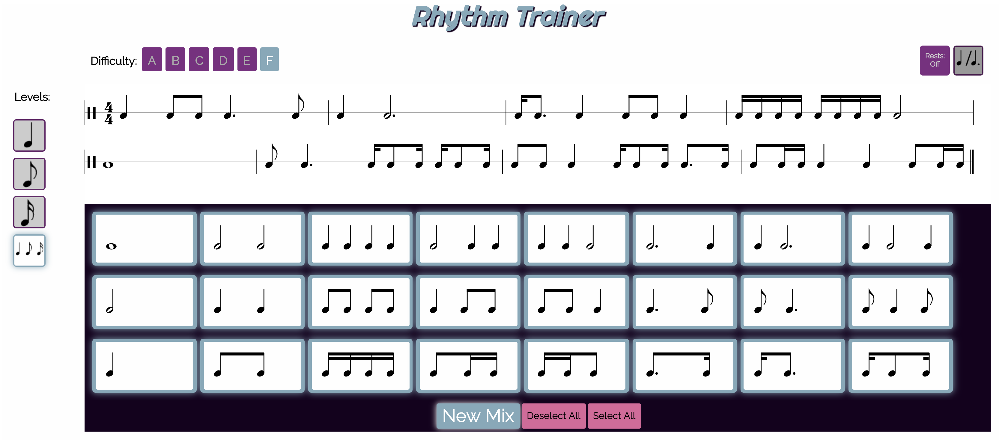

# Rhythm Trainer

A static webpage for generating progressive rhythmic sight reading passages. Select from a series of rhythmic blocks, grouped by complexity and difficulty, to generate a unique 8-measure rhythmic passage.




## Try It!

Simply visit the [Rhythm Trainer](http://rhythmtrainer.app) page to try it out for yourself. Select the blocks you'd like to use to generate the passage and get practicing!

## Development setup

Clone this repository to your local machine and visit the `index.html` file from any modern web browser to view the trainer.
To get there, just type the following in your browser:

>```<the path to your project>/index.html```


## Meta

Built, for Jeremy Marino and the students of the Libertyville High School music department, by Matt Farmer – [@mrfarmer777](https://twitter.com/mrfarmer777) – matt-farmer.com


[https://github.com/mrfarmer777](https://github.com/mrfarmer777)

Distributed under the MIT license. See ``LICENSE`` for more information.

### Built With
[Vexflow](https://github.com/0xfe/vexflow) - a JavaScript library for rending musical notation in the browser. Checkout Vexflow docs [here](http://www.vexflow.com/)

## Contributing
Want to add a feature or fix a bug? Be a rhythmic hero and contribute to this project!

1. Fork it (<https://github.com/mrfarmer777/rhythm_app/fork>)
2. Create your feature branch (`git checkout -b feature/fooBar`)
3. Commit your changes (`git commit -am 'Add some fooBar'`)
4. Push to the branch (`git push origin feature/fooBar`)
5. Create a new Pull Request
